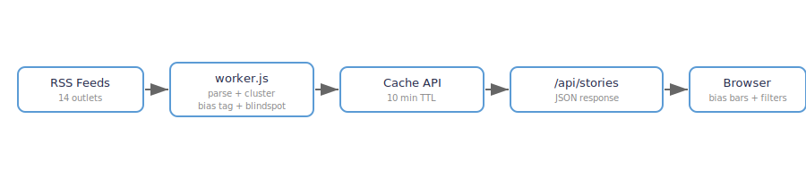

# Newsline

  [](https://github.com/nulljosh/newsline)

RSS news reader across 15 sources — including Hacker News, CNN, Fox, BBC, Reuters and more. A flat **Latest** feed for plain reading, plus a Ground News-style bias view that clusters same-story headlines and flags "blindspot" stories only one side covers.

[Live](https://news.heyitsmejosh.com)

## How it works

A single Cloudflare Worker (`worker.js`) polls 15 RSS feeds and returns two views from one `/api/stories` response:

- **`latest`** — a flat, reverse-chronological feed of every headline across all sources (dateless items sink to the bottom). This is the default reader view.
- **`stories`** — headlines clustered by title-keyword overlap, each tagged left/center/right, with blindspot detection.

The frontend (`public/index.html`) defaults to the Latest reader with a **source picker** (view any single source — HN only, CNN only, …) and search, plus tabs to switch into the bias-clustered view.



## Sources

CBC · The Guardian · CNN · NPR · MSNBC · BBC · Reuters · AP · CTV · Global News · National Post · Fox News · NY Post · Daily Wire · Hacker News

Add one by appending `[outlet, bias, url]` to `FEEDS` at the top of `worker.js`. Any RSS 2.0 or Atom feed works.

## Develop

```
npm test          # node test.mjs — parser, latest sort, cluster
npm run deploy     # wrangler deploy
```

Cloudflare Workers + Workers Static Assets — one deploy serves both the page and `/api/stories`.

## License

MIT 2026, Joshua Trommel
