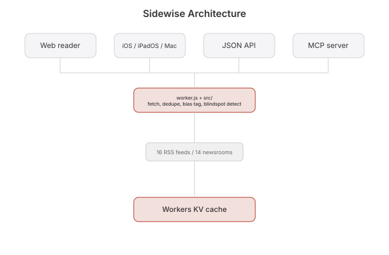

# Newsline

  [](https://github.com/nulljosh/newsline)

Headlines from 17 news outlets across the political spectrum, with left/center/right bias tags and **blindspot** detection — stories covered by only one side. Free, unauthenticated, no rate limit.

Four ways in: a [web reader](https://news.heyitsmejosh.com), native [iPhone/iPad/Mac apps](https://news.heyitsmejosh.com/app), a JSON API, and an MCP server.

## Apps

SwiftUI, one codebase for iOS and macOS, in `ios/`. Reads the same public API — no account, no
tracking, saved stories and the feed cache stay on device.

```
cd ios && xcodegen generate
xcodebuild -scheme Newsline-iOS -destination 'generic/platform=iOS Simulator' build
```

## MCP

```
claude mcp add --transport http newsline https://news.heyitsmejosh.com/mcp
```

| Tool | Params | Returns |
|---|---|---|
| `get_news` | `view`, `outlet`, `bias`, `q`, `limit` | Current headlines, flat or clustered by story |
| `get_blindspots` | `limit` | Only stories covered by a single political side |

Stateless streamable HTTP, no auth. Works with any MCP client — Claude Desktop, Claude Code, Cursor.

## API

`GET https://news.heyitsmejosh.com/api/stories` — every parameter is optional.

| Param | Values | Default |
|---|---|---|
| `view` | `latest`, `stories`, `both` | `both` |
| `outlet` | any outlet name, e.g. `Hacker News` | all |
| `bias` | `left`, `center`, `right` | all |
| `blindspot` | `true` | off |
| `q` | substring match on headline text | none |
| `limit` | 1–200 | 60 clusters / 120 headlines |

```bash
curl 'https://news.heyitsmejosh.com/api/stories?view=stories&blindspot=true'
curl 'https://news.heyitsmejosh.com/api/stories?view=latest&outlet=Hacker%20News&limit=10'
```

```json
{
  "updated": 1754700000000,
  "stories": [
    {
      "title": "Fed holds rates steady",
      "blindspot": false,
      "sources": [
        { "title": "Fed holds rates steady", "link": "https://…", "outlet": "NPR", "bias": -1 },
        { "title": "Fed refuses to cut rates", "link": "https://…", "outlet": "Fox News", "bias": 2 }
      ]
    }
  ],
  "latest": [
    { "title": "Fed holds rates steady", "link": "https://…", "outlet": "NPR", "bias": -1, "ts": 1754699000000 }
  ]
}
```

CORS open to all origins. Feeds are re-pulled at most every 2 minutes; responses themselves are `no-store` (see below). `ts` is epoch ms, or `0` when the feed published no date (those sort to the bottom). Full spec: [`openapi.yaml`](https://news.heyitsmejosh.com/openapi.yaml) · orientation for agents: [`llms.txt`](https://news.heyitsmejosh.com/llms.txt).

## How it works

One Cloudflare Worker (`worker.js`) polls 17 RSS feeds and serves the page, the API, and MCP off a single cached pull:

- **`latest`** — flat reverse-chronological feed across all sources.
- **`stories`** — headlines clustered by title-keyword overlap, each source tagged left/center/right, one-sided clusters flagged `blindspot`.

Only the feed pull is cached, under a constant key. Filtering happens per-request in `shape()` downstream of it, and responses go out `no-store` — the zone's CDN cache ignores query strings, so caching them would serve one caller's `?outlet=` to everyone. Nothing is refetched either way; only the cheap filtering runs again.

Clusters are filtered *after* clustering, and the flat feed *before* its 120-item cap. Both orderings matter: narrowing the input first would destroy the cross-outlet comparison, and filtering after the cap would hide low-volume outlets.



## Bias scores

Each source carries a score from `-2` (left) to `+2` (right); `0` is center, or non-political for tech outlets like Hacker News and Daring Fireball. These are hand-assigned in `FEEDS`, not a third-party rating — treat them as a rough lean.

CBC · The Guardian · NPR · BBC · Global News · National Post · Fox News · NY Post · Daily Wire · Hacker News · Daring Fireball · NBC News · Wall Street Journal · NY Post Opinion · Vancouver Sun · The Province

Add one by appending `[outlet, bias, url]` to `FEEDS` at the top of `worker.js`. Any RSS 2.0 or Atom feed works.

## Develop

```
npm test         # node test.mjs — parser, sort, cluster, shape filters
npm run deploy   # wrangler deploy
```

Cloudflare Workers + Workers Static Assets — one deploy serves the page, `/api/stories`, and `/mcp`.

Security: see [SECURITY.md](SECURITY.md).

## License

MIT 2026, Joshua Trommel. Headlines and links belong to their publishers — Newsline stores nothing and links out to the original article.
